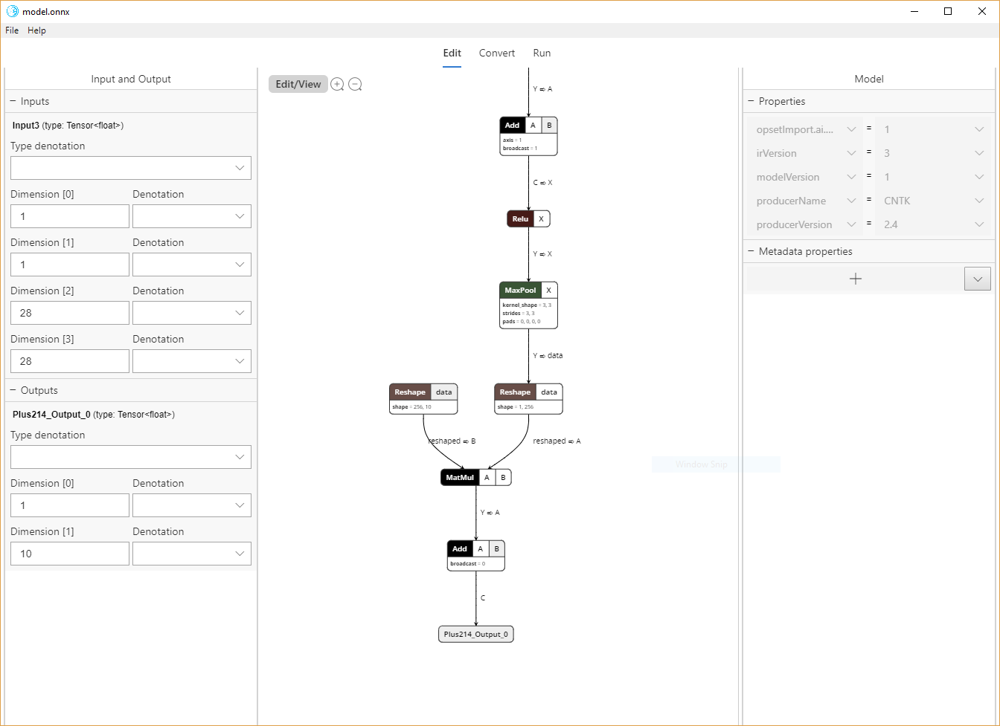

| Sample/Tool | Status |
|---------|--------------|
| All Samples |  |
| WinmlRunner |  |
| WinML Dashboard | [?branchName=master)](https://microsoft.visualstudio.com/WindowsAI/_build/latest?definitionId=39375&branchName=master) |

# Windows ML

Welcome to the Windows ML repo! Windows ML allows you to use trained machine learning models in your Windows apps (C#, C++, Javascript). The Windows ML inference engine evaluates trained models locally on Windows devices. Hardware optimizations for CPU and GPU additionally enable high performance for quick evaluation results.

In this repo, you will find sample apps that demonstrate how to use Windows ML to build machine learning applications, and tools that help verify models and troubleshoot issues during development on Windows 10. 

For additional information on Windows ML, including step-by-step tutorials and how-to guides, please visit the [Windows ML documentation](https://docs.microsoft.com/en-us/windows/ai/).

## Developer Tools
- **[WinML Dashboard (Preview)](https://github.com/Microsoft/Windows-Machine-Learning/tree/master/Tools/WinMLDashboard)**: a GUI-based tool for viewing, editing, converting, and validating machine learning models for Windows ML inference engine. 
[Download Preview Version](https://github.com/microsoft/Windows-Machine-Learning/releases)

  

- **[WinML Code Generator (mlgen)](https://marketplace.visualstudio.com/items?itemName=WinML.mlgen)**: a Visual Studio extension to help you get started using WinML APIs on UWP apps by generating a template code when you add a trained ONNX file into the UWP project. From the template code you can load a model, create a session, bind inputs, and evaluate with wrapper codes. See [docs](https://docs.microsoft.com/en-us/windows/ai/mlgen) for more info.

  Download for [VS 2017](https://marketplace.visualstudio.com/items?itemName=WinML.mlgen), [VS 2019](https://marketplace.visualstudio.com/items?itemName=WinML.MLGenV2)

- **[WinMLRunner](https://github.com/Microsoft/Windows-Machine-Learning/tree/master/Tools/WinMLRunner)**: a command-line tool that can run .onnx or .pb models where the input and output variables are tensors or images. It is a very handy tool to quickly validate an ONNX model. It will attempt to load, bind, and evaluate a model and print out helpful messages. It also captures performance measurements.

  [Download x64 Exe](https://github.com/microsoft/Windows-Machine-Learning/releases)

- **[WinMLTools](https://pypi.org/project/winmltools/)**: a Python tool for converting models from different machine learning toolkits into ONNX for use with Windows ML.

## Sample apps

These generic examples show how to use various models and input feeds with Windows ML. We have both C++ native desktop apps and C# and Javascript UWP samples

- **[FNSCandyStyleTransfer\UWP\cs](https://github.com/Microsoft/Windows-Machine-Learning/tree/master/Samples/FNSCandyStyleTransfer)**: a UWP C# app that uses the FNS-Candy style transfer model to make a cool image.
- **[SqueezeNetObjectDetection\UWP\cs](https://github.com/Microsoft/Windows-Machine-Learning/tree/master/Samples/SqueezeNetObjectDetection/UWP/cs)**: a UWP C# app that uses the SqueezeNet model to detect the predominant object in an image.
- **[SqueezeNetObjectDetection\UWP\js](https://github.com/Microsoft/Windows-Machine-Learning/tree/master/Samples/SqueezeNetObjectDetection/UWP/js)**: a UWP Javascript app that uses SqueezeNet model to detect the predominant object in an image. 
- **[SqueezeNetObjectDetection\Desktop\cpp](https://github.com/Microsoft/Windows-Machine-Learning/tree/master/Samples/SqueezeNetObjectDetection/Desktop/cpp)**: a classic desktop C++/WinRT app that uses the SqueezeNet model to detect the predominant object in an image.
- **[SqueezeNetObjectDetection\NETCore\cs](https://github.com/Microsoft/Windows-Machine-Learning/tree/master/Samples/SqueezeNetObjectDetection/Desktop/cpp)**: a .NET Core 2 application that uses the SqueezeNet model to detect the predominant object in an image.
- **[MNIST\UWP\cs](https://github.com/Microsoft/Windows-Machine-Learning/tree/master/Samples/MNIST/Tutorial/cs)**: a UWP C# app that uses the MNIST model to detect numberic characters.
- **[MNIST\UWP\cppcx](https://github.com/Microsoft/Windows-Machine-Learning/tree/master/Samples/MNIST/UWP)**: a UWP C++/CX app that uses the MNIST model to detect numberic characters.
- **[CustomTensorization](https://github.com/Microsoft/Windows-Machine-Learning/tree/master/Samples/CustomTensorization)**: a Windows Console Application (C++/WinRT) that shows how to do custom tensorization.
- **[Emoji8](https://github.com/Microsoft/Windows-Machine-Learning/tree/master/Samples/Emoji8)**: a UWP C# app that uses the FER Emotion model to evaluate how well the user's facial expressions match randomly selected emojis.
- **[CustomOperatorCPU](https://github.com/Microsoft/Windows-Machine-Learning/tree/master/Samples/CustomOperator)**: a desktop app that defines multiple custom cpu operators. One of these is a debug operator which we invite you to integrate into your own workflow.
- **[AdapterSelection](https://github.com/Microsoft/Windows-Machine-Learning/tree/master/Samples/AdapterSelection)**: a desktop app that demonstrates how to choose a specific device adapter for running your model
- **[PlaneIdentifier](https://github.com/Microsoft/Windows-AppConsult-Samples-UWP/tree/master/PlaneIdentifier)**: a UWP app and a WPF app packaged with the Desktop Bridge, sharing the same model trained using [Azure Custom Vision service](https://customvision.ai/). For step-by-step instructions for this sample, please see the blog post [Upgrade your WinML application to the latest bits](https://blogs.msdn.microsoft.com/appconsult/2018/11/06/upgrade-your-winml-application-to-the-latest-bits/).

## Using the samples
### Requirements

- [Visual Studio 2017 Version 15.7.4 or Newer](https://developer.microsoft.com/en-us/windows/downloads)
- [Windows 10 - Build 17763 (RS5) or Newer](https://www.microsoft.com/en-us/software-download/windowsinsiderpreviewiso)
- [Windows SDK - Build 17763 (RS5) or Newer](https://www.microsoft.com/en-us/software-download/windowsinsiderpreviewSDK)
- Visual Studio Extension for C++/WinRT for C++/WinRT apps

  Do the following to add the C++/WinRT extension in Visual Studio.
  1. Go to **Tools > Extensions and Updates**. 
  2. Select **Online** in the left pane and search for "WinRT" using the search box.
  3. Select the **C++/WinRT** extension, click **Download**, and close Visual Studio. The extension should install automatically.
  4. When the extension has finished installing, re-open Visual Studio.

The easiest way to use these samples without using Git is to download the zip file containing the current version (using the following link or by clicking the "Download ZIP" button on the repo page). You can then unzip the entire archive and use the samples in Visual Studio 2017.

[Download the samples ZIP](https://github.com/Microsoft/Windows-Machine-Learning/archive/master.zip)

Notes:
Before you unzip the archive, right-click it, select Properties, and then select Unblock.
Be sure to unzip the entire archive, and not just individual samples. The samples all depend on the SharedContent folder in the archive.
In Visual Studio 2017, the platform target defaults to ARM, so be sure to change that to x64 or x86 if you want to test on a non-ARM device.

Reminder: If you unzip individual samples, they will not build due to references to other portions of the ZIP file that were not unzipped. You must unzip the entire archive if you intend to build the samples.

## Feedback
- For issues, file a bug on [GitHub Issues](https://github.com/Microsoft/Windows-Machine-Learning/issues).
- Ask questions on [Stack Overflow](https://stackoverflow.com/questions/tagged/windows-machine-learning).
- Vote for popular feature requests on [Windows Developer Feedback](https://wpdev.uservoice.com/forums/110705-universal-windows-platform?category_id=341035) or include your own request.

## Related Projects
 - [ONNX: Open Neural Network Exchange Project](https://onnx.ai/).

## Contributing

We're always looking for your help to fix bugs and improve the samples. Create a pull request, and we'll be happy to take a look.

This project has adopted the [Microsoft Open Source Code of Conduct](https://opensource.microsoft.com/codeofconduct/).
For more information see the [Code of Conduct FAQ](https://opensource.microsoft.com/codeofconduct/faq/) or
contact [opencode@microsoft.com](mailto:opencode@microsoft.com) with any additional questions or comments.
