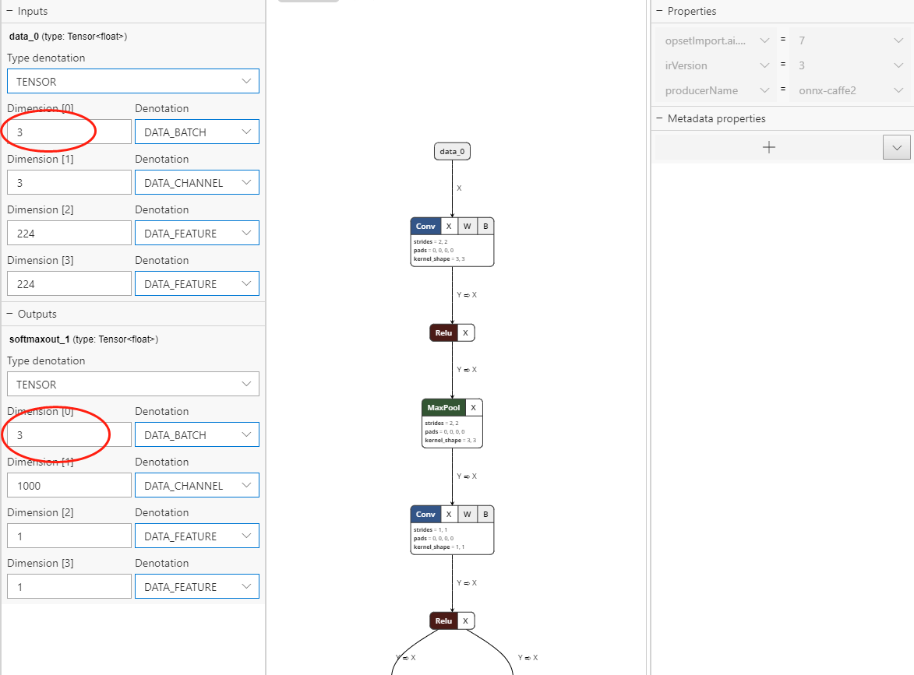
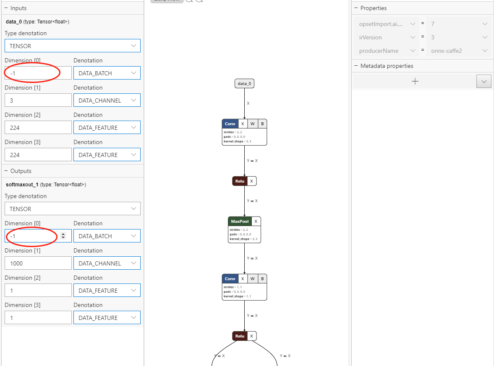

# Sample of Using Batch

## Overview

This sample tells how to bind and evaluate batches of input in WinML

## Requirements

- [Visual Studio 2017 - 15.4 or higher](https://developer.microsoft.com/en-us/windows/downloads)
- [Windows 10 - Build 18362 or higher](https://www.microsoft.com/en-us/software-download/windowsinsiderpreviewiso)
- [Windows SDK - Build 18362 or higher](https://www.microsoft.com/en-us/software-download/windowsinsiderpreviewSDK)
- Visual Studio Extension for C++/WinRT

  Do the following to add the C++/WinRT extension in Visual Studio.
  1. Go to **Tools > Extensions and Updates**. 
  2. Select **Online** in the left pane and search for "WinRT" using the search box.
  3. Select the **C++/WinRT** extension, click **Download**, and close Visual Studio. The extension should install automatically.
  4. When the extension has finished installing, re-open Visual Studio.


## Build the sample

1. If you download the samples ZIP, be sure to unzip the entire archive, not just the folder with the sample you want to build.
2. Start Microsoft Visual Studio 2017 and select **File > Open > Project/Solution**.
3. Starting in the folder where you unzipped the samples, go to the **Samples** subfolder, then the subfolder for this specific sample (**Sample\BatchSupport**). Double-click the Visual Studio solution file (BatchSupport.sln).
4. Confirm that the project is pointed to the correct SDK that you installed (e.g. 18362). You can do this by right-clicking the project in the **Solution Explorer**, selecting **Properties**, and modifying the **Windows SDK Version**.
5. Confirm that you are set for the right configuration and platform (for example: Debug, x64).
6. Build the solution (**Ctrl+Shift+B**).

## Run the sample

1. Open a Command Prompt (in the Windows 10 search bar, type **cmd** and press **Enter**).
2. Change the current folder to the folder containing the built EXE (`cd <path-to-exe>`).
3. Run the executable as shown below. Make sure to replace the install location with what matches yours:
  ```
  SqueezeNetObjectDetection.exe [fixedBatchSize|freeBatchSize] [TensorFloat|VideoFrame]
  ```
4. You should get output similar to the following:
    ```
    Loading modelfile 'E:\xianz\Windows-Machine-Learning\Samples\BatchSupport\x64\Debug\SqueezeNet.onnx' on the CPU
    model file loaded in 906 ticks
    Binding...
    Running the model...
    model run took 31 ticks
    Result for No.0 input
    tench, Tinca tinca with confidence of 0.738503
    Result for No.1 input
    tabby, tabby cat with confidence of 0.931461
    Result for No.2 input
    tench, Tinca tinca with confidence of 0.738503
    ```

## Prepare Model
1. Download [WinMLDashboard](https://github.com/microsoft/Windows-Machine-Learning/releases/tag/v0.6.1) 
2. change the batch dimension of model input and output to a fixed number or -1 (free dimension)
      

## Create Session and Bind Inputs
Take binding batches of VideoFrame as example:

### 1. Create Session:
1.1 for fixed batch dimension:
   ```C++
    //create a session and binding
    LearningModelDeviceKind deviceKind = LearningModelDeviceKind::Cpu;
    LearningModelSession session(model, LearningModelDevice(deviceKind));
    LearningModelBinding binding(session);
   ```

1.2 for free-dimensional batch size:
   ```C++
    // create a session and binding
    LearningModelDeviceKind deviceKind = LearningModelDeviceKind::Cpu;
    LearningModelSessionOptions options;
    if ("freeBatchSize" == modelType) { 
        // If the model has free dimentional batch, override the free dimension with batch_size
        options.BatchSizeOverride(static_cast<uint32_t>(BATCH_SIZE));
    }
    LearningModelSession session(model, LearningModelDevice(deviceKind), options);
    LearningModelBinding binding(session);
   ```

### 2. Bind Inputs
```C++
    // Create Batches of VideoFrame
    std::vector<VideoFrame> inputVideoFrames = {};
    for (hstring imageName : imageNames) {
        auto imagePath = static_cast<hstring>(GetModulePath().c_str()) + imageName;
        auto imageFrame = LoadImageFile(imagePath);
        inputVideoFrames.emplace_back(imageFrame);
    }
    auto videoFrames = winrt::single_threaded_vector(std::move(inputFrames));

    // Bind
    binding.Bind(inputFeatureDescriptor.Current().Name(), inputVideoFrames);
```

### 3. Bind Outputs(optional)

The sample does not bind the output, but you could also bind the output as below:
```C++
  auto outputShape = std::vector<int64_t>{BATCH_SIZE, 1000, 1, 1};	
  auto outputValue = TensorFloat::Create(outputShape);	
  std::wstring outputDataBindingName =	
      std::wstring(model.OutputFeatures().First().Current().Name());	
  binding.Bind(outputDataBindingName, outputValue);
  SampleHelper::PrintResults(outputValue.GetAsVectorView()); // Print Results
```