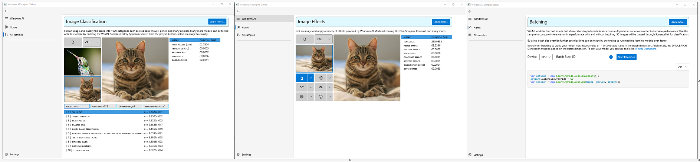

# WinML Samples Gallery

Demonstrates different machine learning scenarios and features using [Windows ML](https://docs.microsoft.com/en-us/windows/ai/windows-ml/) in an interactive format. This app is the interactive companion shows the integration of [Windows Machine Learning Library APIs](https://docs.microsoft.com/en-us/uwp/api/windows.ai.machinelearning) into a desktop [WinUI 3](https://github.com/microsoft/microsoft-ui-xaml) application.

- [Getting Started](#getting-started)
- [Build From Source](#build-from-source)
- [Samples](#samples)
- [Feedback]($feedback)
- [External Links](#links)

## Getting Started
- The WinML Samples Gallery is available in the Microsoft Store. Click [here](./) to download.
- Check out the [source](https://github.com/microsoft/Windows-Machine-Learning/tree/master/Samples/WinMLSamplesGallery/WinMLSamplesGallery/Samples) for each sample.

## Build From Source
To learn how to implement these features in your application, or unlock additional functionality that may not be available in the Store Application, you may need to build the WinML Samples Gallery from source. Follow these instructions to build from source.

### Prerequisites
- [Visual Studio 2017 Version 15.7.4 or Newer](https://developer.microsoft.com/en-us/windows/downloads)
- [Windows SDK - Build 18362 or Newer](https://developer.microsoft.com/en-us/windows/downloads/sdk-archive/)

### Build
- Clone this repository.
- Navigate to **Windows-Machine-Learning/Samples/WinMLSamplesGallery**.
    - *(optional)* Make any changes to the *.csproj files needed to enable functionality.
- Launch **WinMLSamplesGallery.sln**
- Build and deploy the **WinMLSamplesGallery (Package)** project.

## Samples
- [Image Classifiation](./WinMLSamplesGallery/Samples/ImageClassifier): This sample demonstrates image classification using a large number of models taken from the [ONNX Model Zoo](https://github.com/onnx/models).

- [Image Effects](./WinMLSamplesGallery/Samples/ImageEffects): See how to apply preprocessing and postprocessing effects using platform and hardware agnostic ONNX Models and [chaining in Windows ML](https://docs.microsoft.com/en-us/windows/ai/windows-ml/chaining). 

- [Batched Inputs](./WinMLSamplesGallery/Samples/Batching): See how to speed up inference with batched inputs.

- [OpenCV](./WinMLSamplesGallery/Samples/OpenCVInterop): See how to integrate [Windows ML](https://docs.microsoft.com/en-us/windows/ai/windows-ml/) with [OpenCV](https://github.com/opencv/opencv).

- [ImageSharp](./WinMLSamplesGallery/Samples/ImageSharpInterop): See how to integrate [Windows ML](https://docs.microsoft.com/en-us/windows/ai/windows-ml/) with [ImageSharp](https://docs.sixlabors.com/articles/imagesharp/index.html).
## Feedback
Please file an issue [here](https://github.com/microsoft/Windows-Machine-Learning/issues/new) if you encounter any issues with the WinML Samples Gallery or wish to request a new sample.

## External Links

- [Windows ML Library (WinML)](https://docs.microsoft.com/en-us/windows/ai/windows-ml/)
- [DirectML](https://github.com/microsoft/directml)
- [ONNX Model Zoo](https://github.com/onnx/models)
- [Windows UI Library (WinUI)](https://docs.microsoft.com/en-us/windows/apps/winui/) 