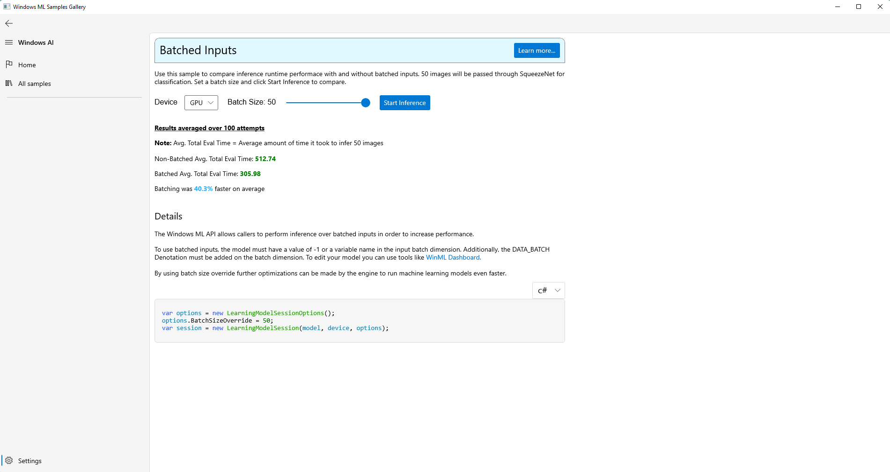

?# WinML Samples Gallery: Batching
 Perform infererence over multiple inputs at once to increase runtime performance.
 
 Use this sample to compare inference runtime performace with and without batched inputs. 50 images will be passed through SqueezeNet for classification. Set a batch size and click Start Inference to compare.
 
## Feedback
Please file an issue [here](https://github.com/microsoft/Windows-Machine-Learning/issues/new) if you encounter any issues with the WinML Samples Gallery or wish to request a new sample.

- [Getting Started](#getting-started)
- [Feedback]($feedback)
- [External Links](#links)

## Getting Started
- Check out the [source](https://github.com/microsoft/Windows-Machine-Learning/blob/master/Samples/WinMLSamplesGallery/WinMLSamplesGallery/Samples/Batching/Batching.xaml.cs).

## External Links

- [Windows ML Library (WinML)](https://docs.microsoft.com/en-us/windows/ai/windows-ml/)
- [DirectML](https://github.com/microsoft/directml)
- [ONNX Model Zoo](https://github.com/onnx/models)
- [Windows UI Library (WinUI)](https://docs.microsoft.com/en-us/windows/apps/winui/) 