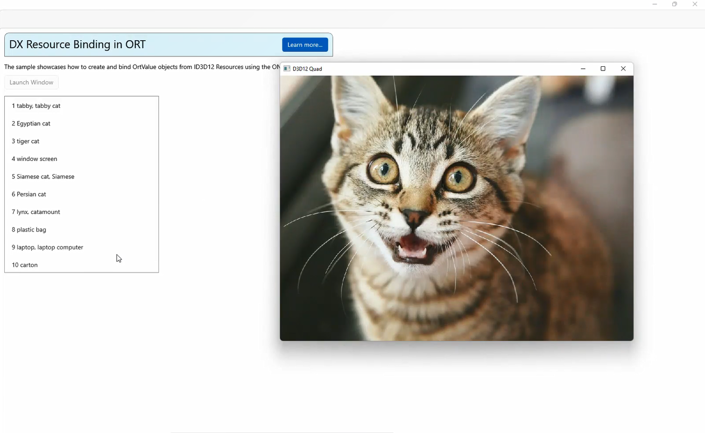

# Windows ML Samples Gallery: DX Resource Binding in ORT
Learn how to bind and evaluate DirectX Resources using ONNX Runtime.

The sample showcases how to create and bind OrtValue objects from ID3D12 Resources using the ONNX Runtime C-API.

- [Getting Started](#getting-started)
- [Feedback](#feedback)
- [External Links](#external-links)

## Getting Started
- Check out the [C# source](https://github.com/microsoft/Windows-Machine-Learning/blob/master/Samples/WinMLSamplesGallery/WinMLSamplesGallery/Samples/DXResourceBindingORT/DXResourceBindingORT.xaml.cs).
- Check out the [C++ source](https://github.com/microsoft/Windows-Machine-Learning/blob/master/Samples/WinMLSamplesGallery/WinMLSamplesGalleryNative/DXResourceBinding.cpp).
- Learn how to [copy a Texture2D into a Resource Dimension Buffer](https://github.com/microsoft/Windows-Machine-Learning/blob/master/Samples/WinMLSamplesGallery/WinMLSamplesGalleryNative/D3D12Quad.cpp#L371)
- Learn how to [create an ORT tensor from a D3D Resource](https://github.com/microsoft/Windows-Machine-Learning/blob/master/Samples/WinMLSamplesGallery/WinMLSamplesGalleryNative/ORTHelpers.cpp#L121)
- Learn how to [preprocess](https://github.com/microsoft/Windows-Machine-Learning/blob/master/Samples/WinMLSamplesGallery/WinMLSamplesGalleryNative/ORTHelpers.cpp#L48) and [evaluate](https://github.com/microsoft/Windows-Machine-Learning/blob/master/Samples/WinMLSamplesGallery/WinMLSamplesGalleryNative/ORTHelpers.cpp#L48) an ORT tensor using ORT with DML

## Feedback
Please file an issue [here](https://github.com/microsoft/Windows-Machine-Learning/issues/new) if you encounter any issues with the Windows ML Samples Gallery or wish to request a new sample.

## External Links
- [Onnx Runtime](https://onnxruntime.ai/docs/)
- [Direct 3D 12](https://learn.microsoft.com/en-us/windows/win32/direct3d12/what-is-directx-12-)
- [DirectML](https://github.com/microsoft/directml)
- [Windows ML Library (WinML)](https://docs.microsoft.com/en-us/windows/ai/windows-ml/)