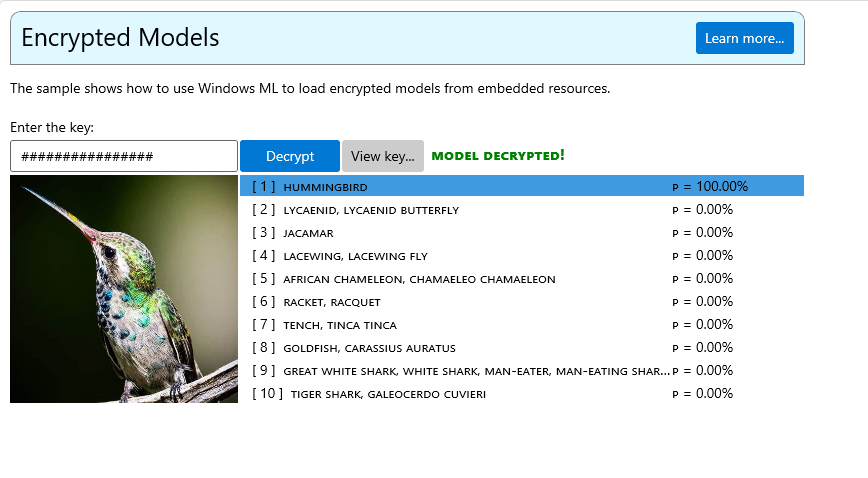

# Windows ML Samples Gallery: Encrypted Model
This sample demonstrates how decrypt and load models that are stored securely as embedded binary resources in [Windows ML](https://docs.microsoft.com/en-us/windows/ai/windows-ml/).

The demo decrypts an encrypted version of the [SqueezeNet](https://github.com/onnx/models/tree/master/vision/classification/squeezenet) image classification model and performs inference with the decrypted model.

- [Licenses](#licenses)
- [Getting Started](#getting-started)
- [Feedback]($feedback)
- [External Links](#links)

## Licenses
See [ThirdPartyNotices.txt](../../../../../ThirdPartyNotices.txt) for relevant license info.

## Getting Started
- Check out source for how to load resources and decrypt models efficiently [here](https://github.com/microsoft/Windows-Machine-Learning/blob/a08bb78dd3cd9a6449e2d02ae3cbb41b10ead463/Samples/WinMLSamplesGallery/WinMLSamplesGallery/Samples/EncryptedModel/EncryptedModel.xaml.cs).
- Check out source for how the managed sample performs inference [here](https://github.com/microsoft/Windows-Machine-Learning/blob/a08bb78dd3cd9a6449e2d02ae3cbb41b10ead463/Samples/WinMLSamplesGallery/WinMLSamplesGallery/Samples/EncryptedModel/EncryptedModel.xaml.cs) to the the latest list of supported models.

## Feedback
Please file an issue [here](https://github.com/microsoft/Windows-Machine-Learning/issues/new) if you encounter any issues with this sample.

## External Links

- [Windows ML Library (WinML)](https://docs.microsoft.com/en-us/windows/ai/windows-ml/)
- [DirectML](https://github.com/microsoft/directml)
- [ONNX Model Zoo](https://github.com/onnx/models)
- [Windows UI Library (WinUI)](https://docs.microsoft.com/en-us/windows/apps/winui/) 