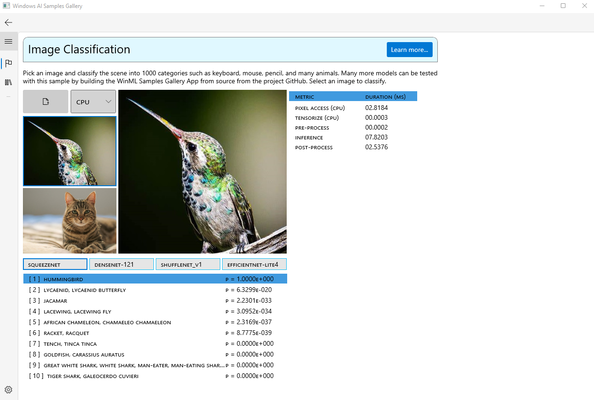

# WinML Samples Gallery: Image Classification
Pick an image and classify the scene into 1000 categories such as keyboard, mouse, pencil, and many animals. This sample demonstrates image classification using a large number of models taken from the [ONNX Model Zoo](https://github.com/onnx/models).

This sample demonstrates how to run image classification models using [Windows ML APIs](https://docs.microsoft.com/en-us/uwp/api/windows.ai.machinelearning) on [Windows 8.1](https://www.microsoft.com/en-us/software-download/windows8ISO) and [newer Windows operating systems](https://www.microsoft.com/en-us/windows/get-windows-11).



- [Getting Started](#getting-started)
- [Models](#models)
- [Large Models](#large-models)
- [Feedback]($feedback)
- [External Links](#links)


## Getting Started
- Check out the [source](https://github.com/microsoft/Windows-Machine-Learning/blob/a08bb78dd3cd9a6449e2d02ae3cbb41b10ead463/Samples/WinMLSamplesGallery/WinMLSamplesGallery/Samples/ImageClassifier/ImageClassifier.xaml.cs#L123) to the the latest list of supported models.
- Learn about the [preprocessing](https://github.com/microsoft/Windows-Machine-Learning/blob/a08bb78dd3cd9a6449e2d02ae3cbb41b10ead463/Samples/WinMLSamplesGallery/WinMLSamplesGallery/Samples/ImageClassifier/ImageClassifier.xaml.cs#L168) requirements for each model.
- Learn about the [postprocessing](https://github.com/microsoft/Windows-Machine-Learning/blob/a08bb78dd3cd9a6449e2d02ae3cbb41b10ead463/Samples/WinMLSamplesGallery/WinMLSamplesGallery/Samples/ImageClassifier/ImageClassifier.xaml.cs#L143) requirements for each model.

## Models
The WinML Samples Gallery ships with only a subset of the models due to size considerations. To access all of the models, check out  [Large Models](#large-models).

Each model has its own input and output specification that determines the pre and post processing needed during integration.

- [DenseNet](https://github.com/onnx/models/tree/master/vision/classification/densenet-121)
- [EfficientNet](https://github.com/onnx/models/tree/master/vision/classification/efficientnet-lite4)
- [ShuffleNetV1](https://github.com/onnx/models/tree/master/vision/classification/shufflenet)
- [SqueezeNet](https://github.com/onnx/models/tree/master/vision/classification/squeezenet)

## Large Models
To build and demo the full list of models as shown below, you will need to build from source. Follow the instructions [here](https://github.com/microsoft/Windows-Machine-Learning/tree/master/Samples/WinMLSamplesGallery#build-from-source). In addition you will need to set the ```UseLargeModels ``` property to ```True``` in **WinMLSamplesGallery.csproj** like below:
```
<UseLargeModels Condition="$(UseLargeModels) == ''">True</UseLargeModels>
```
By enabling large models, the build will automatically download, package, and light up the new models in the Image Classification sample. 
- [AlexNet](https://github.com/onnx/models/tree/master/vision/classification/alexnet)
- [CaffeNet](https://github.com/onnx/models/tree/master/vision/classification/caffenet)
- [DenseNet](https://github.com/onnx/models/tree/master/vision/classification/densenet-121)
- [EfficientNet](https://github.com/onnx/models/tree/master/vision/classification/efficientnet-lite4)
- [Emoji8](https://blogs.windows.com/windowsdeveloper/2018/11/16/introducing-emoji8/)
- [GoogleNet](https://github.com/onnx/models/tree/master/vision/classification/inception_and_googlenet/googlenet)
- [InceptionV1](https://github.com/onnx/models/tree/master/vision/classification/inception_and_googlenet/inception_v1)
- [InceptionV2](https://github.com/onnx/models/tree/master/vision/classification/inception_and_googlenet/inception_v2)
- [MNIST](https://github.com/onnx/models/tree/master/vision/classification/mnist)
- [MobileNetV2](https://github.com/onnx/models/tree/master/vision/classification/mobilenet)
- [RCNN](https://github.com/onnx/models/tree/master/vision/classification/rcnn_ilsvrc13)
- [ResNet50](https://github.com/onnx/models/tree/master/vision/classification/resnet)
- [ShuffleNetV1](https://github.com/onnx/models/tree/master/vision/classification/shufflenet)
- [ShuffleNetV2](https://github.com/onnx/models/tree/master/vision/classification/shufflenet)
- [SqueezeNet](https://github.com/onnx/models/tree/master/vision/classification/squeezenet)
- [VGG19](https://github.com/onnx/models/tree/master/vision/classification/vgg)
- [VGG19bn](https://github.com/onnx/models/tree/master/vision/classification/vgg)
- [ZFNet512](https://github.com/onnx/models/tree/master/vision/classification/zfnet-512)

## Feedback
Please file an issue [here](https://github.com/microsoft/Windows-Machine-Learning/issues/new) if you encounter any issues with this sample.

## External Links

- [Windows ML Library (WinML)](https://docs.microsoft.com/en-us/windows/ai/windows-ml/)
- [DirectML](https://github.com/microsoft/directml)
- [ONNX Model Zoo](https://github.com/onnx/models)
- [Windows UI Library (WinUI)](https://docs.microsoft.com/en-us/windows/apps/winui/) 