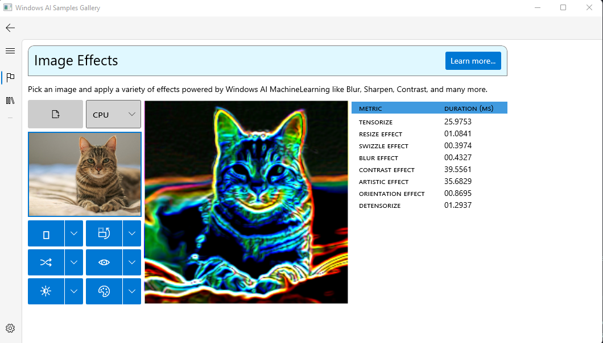

# WinML Samples Gallery: Image Effects
Pick an image and apply a variety of effects powered by Windows AI MachineLearning like Blur, Sharpen, Contrast, and many more. These effects can be used to perform model input image preprocessing, or postprocessing for visualizing outputs.

This sample demonstrates using the ```Windows.AI.MachineLearning.Experimental``` namespace to create efficient pre and post processing models in ONNX.

This sample demonstrates how models can be executed in order using [chaining in Windows ML](https://docs.microsoft.com/en-us/windows/ai/windows-ml/chaining) to create complex machine learning scenarios.



- [Getting Started](#getting-started)
- [Effects](#effects)
- [Feedback]($feedback)
- [External Links](#links)

## Getting Started
- Check out the [source](https://github.com/microsoft/Windows-Machine-Learning/blob/a08bb78dd3cd9a6449e2d02ae3cbb41b10ead463/Samples/WinMLSamplesGallery/WinMLSamplesGallery/Samples/ImageEffects/ImageEffects.xaml.cs#L156) for an example of how to use chaining.

## Effects
This sample demonstrates how to combine a varienty of effects in order to pre processing images and prepare them for a Machine Learning workflow.

These ONNX model effects can be use downlevel and on any ONNX compliant Machine Learning engine such as Windows ML or [ONNX Runtime](https://github.com/microsoft/onnxruntime).

- [Resize Image](https://github.com/microsoft/Windows-Machine-Learning/blob/a08bb78dd3cd9a6449e2d02ae3cbb41b10ead463/Samples/WinMLSamplesGallery/WinMLSamplesGallery/Samples/ImageEffects/ImageEffects.xaml.cs#L321)
- [Change Orientation](https://github.com/microsoft/Windows-Machine-Learning/blob/a08bb78dd3cd9a6449e2d02ae3cbb41b10ead463/Samples/WinMLSamplesGallery/WinMLSamplesGallery/Samples/ImageEffects/ImageEffects.xaml.cs#L345)
- [Pixel Swizzle](https://github.com/microsoft/Windows-Machine-Learning/blob/a08bb78dd3cd9a6449e2d02ae3cbb41b10ead463/Samples/WinMLSamplesGallery/WinMLSamplesGallery/Samples/ImageEffects/ImageEffects.xaml.cs#L335)
- [Blur Image](https://github.com/microsoft/Windows-Machine-Learning/blob/a08bb78dd3cd9a6449e2d02ae3cbb41b10ead463/Samples/WinMLSamplesGallery/WinMLSamplesGallery/Samples/ImageEffects/ImageEffects.xaml.cs#L315)
- [Contrast and Brightness](https://github.com/microsoft/Windows-Machine-Learning/blob/a08bb78dd3cd9a6449e2d02ae3cbb41b10ead463/Samples/WinMLSamplesGallery/WinMLSamplesGallery/Samples/ImageEffects/ImageEffects.xaml.cs#L391)
- [Edge Detection](https://github.com/microsoft/Windows-Machine-Learning/blob/a08bb78dd3cd9a6449e2d02ae3cbb41b10ead463/Samples/WinMLSamplesGallery/WinMLSamplesGallery/Samples/ImageEffects/ImageEffects.xaml.cs#L333)

## Feedback
Please file an issue [here](https://github.com/microsoft/Windows-Machine-Learning/issues/new) if you encounter any issues with this sample.

## External Links

- [Windows ML Library (WinML)](https://docs.microsoft.com/en-us/windows/ai/windows-ml/)
- [DirectML](https://github.com/microsoft/directml)
- [ONNX Model Zoo](https://github.com/onnx/models)
- [Windows UI Library (WinUI)](https://docs.microsoft.com/en-us/windows/apps/winui/) 