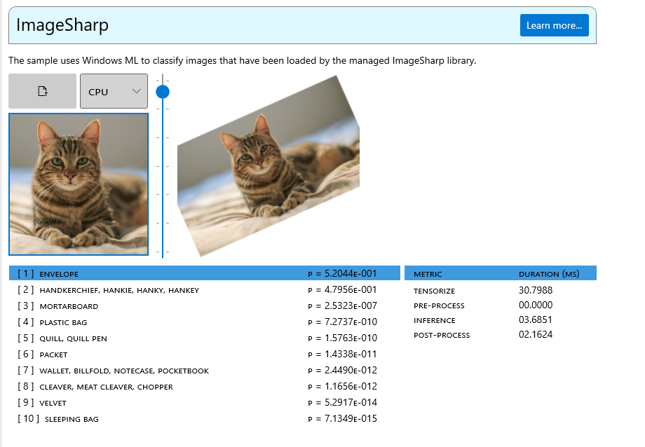

# WinML Samples Gallery: ImageSharp Interop
This sample demonstrates how to interop between [Windows ML](https://docs.microsoft.com/en-us/windows/ai/windows-ml/) and [ImageSharp](https://docs.sixlabors.com/articles/imagesharp/index.html).

ImageSharp is a new, fully featured, fully managed, cross-platform, 2D graphics library.

The demo will run [SqueezeNet](https://github.com/onnx/models/tree/master/vision/classification/squeezenet) image classification in WindowsML and consume images arbitrarily rotated using ImageSharp.

ImageSharp will be used to load, rotate, resize and crop images.
Windows ML will be used to tensorize the image into NCHW format and perform image classification.

- [Licenses](#licenses)
- [Getting Started](#getting-started)
- [Feedback]($feedback)
- [External Links](#links)

## Licenses
See [ThirdPartyNotices.txt](../../../../../ThirdPartyNotices.txt) for relevant license info.

## Getting Started
You can check out the source [here](https://github.com/microsoft/Windows-Machine-Learning/blob/master/Samples/WinMLSamplesGallery/WinMLSamplesGallery/Samples/ImageSharpInterop/ImageSharpInterop.xaml.cs).

## Feedback
Please file an issue [here](https://github.com/microsoft/Windows-Machine-Learning/issues/new) if you encounter any issues with this sample.

## External Links

- [Windows ML Library (WinML)](https://docs.microsoft.com/en-us/windows/ai/windows-ml/)
- [DirectML](https://github.com/microsoft/directml)
- [ONNX Model Zoo](https://github.com/onnx/models)
- [Windows UI Library (WinUI)](https://docs.microsoft.com/en-us/windows/apps/winui/) 