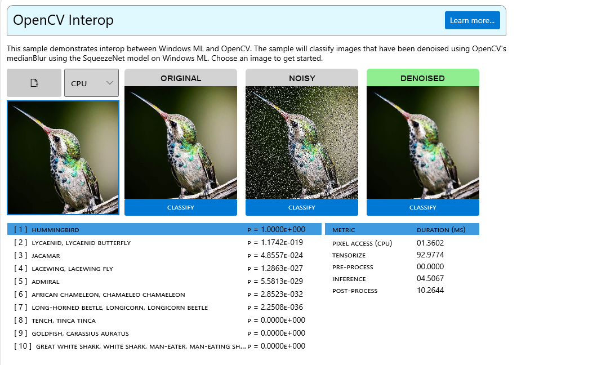

# WinML Samples Gallery: OpenCV Interop
This sample demonstrates how to interop between [Windows ML](https://docs.microsoft.com/en-us/windows/ai/windows-ml/) and [OpenCV](https://github.com/opencv/opencv).

OpenCV (Open Source Computer Vision Library) is an open source computer vision and machine learning software library. OpenCV was built to provide a common infrastructure for computer vision applications and to accelerate the use of machine perception in the commercial products. 

The demo will run [SqueezeNet](https://github.com/onnx/models/tree/master/vision/classification/squeezenet) image classification in WindowsML and consume images loaded and preprocessed using OpenCV.

OpenCV will be used to load images, add salt and pepper noise to the base image, and denoise the image using media blur.
Windows ML will be used to resize and tensorize the image into NCHW format, as well as perform image classification.

- [Licenses](#licenses)
- [Getting Started](#getting-started)
- [Feedback]($feedback)
- [External Links](#links)

## Licenses
See [ThirdPartyNotices.txt](../../../../../ThirdPartyNotices.txt) for relevant license info.

## Getting Started
In order to build this sample, OpenCV will need to be built and linked into the WinML Samples Gallery. The OpenCV project is included as a submodule, and will need to be synced and built for your Platform Architecture and Configuration before it will appear in the Windows ML Samples Gallery. To do so follow these instructions:
- Launch a Visual Studio Developer Command Prompt.
- Navigate to the `repository root` directory.
- Sync submodules with `git submodule update --init --recursive`
- Launch Powershell with `powershell`
- Build the OpenCV project with

  `.\external\tools\BuildOpenCV.ps1 -Architecture <ARCH> -Configuration <CONFIGURATION> -SetupDevEnv`

  For example:

  `.\external\tools\BuildOpenCV.ps1 -Architecture x64 -Configuration Debug`
- Launch the `WinMLSamplesGallery.sln` and build with the same **Architecture** and **Configuration** to see the sample appear.

You can check out the source [here](https://github.com/microsoft/Windows-Machine-Learning/blob/91e493d699df80a633654929418f41bab136ae1d/Samples/WinMLSamplesGallery/WinMLSamplesGalleryNative/OpenCVImage.cpp#L21).

## Feedback
Please file an issue [here](https://github.com/microsoft/Windows-Machine-Learning/issues/new) if you encounter any issues with this sample.

## External Links

- [Windows ML Library (WinML)](https://docs.microsoft.com/en-us/windows/ai/windows-ml/)
- [DirectML](https://github.com/microsoft/directml)
- [ONNX Model Zoo](https://github.com/onnx/models)
- [Windows UI Library (WinUI)](https://docs.microsoft.com/en-us/windows/apps/winui/) 