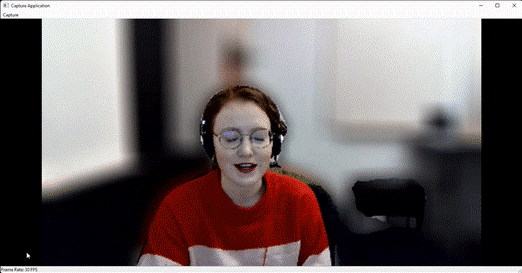

# Windows ML Samples Gallery: Stream Effect
Apply backbround blurring effect to a live video stream. 

The sample showcases how to use Windows ML with a real-time video stream. 

- [Getting Started](#getting-started)
- [Feedback](#feedback)
- [External Links](#external-links)

## Getting Started
- Check out the [C# source](https://github.com/microsoft/Windows-Machine-Learning/blob/master/Samples/WinMLSamplesGallery/WinMLSamplesGallery/Samples/StreamEffect/StreamEffect.xaml.cs).
- Check out the [C++ source](https://github.com/microsoft/Windows-Machine-Learning/blob/master/Samples/WinMLSamplesGallery/WinMLSamplesGalleryNative/StreamEffect.cpp).
- Learn how to [chain together custom LearningModels](https://github.com/microsoft/Windows-Machine-Learning/blob/master/Samples/WinMLSamplesGallery/WinMLSamplesGalleryNative/SegmentModel.h#L31)
- Learn how to [write an async Media Foundation Transform](https://github.com/microsoft/Windows-Machine-Learning/blob/master/Samples/WinMLSamplesGallery/WinMLSamplesGalleryNative/TransformAsync.h)

## Feedback
Please file an issue [here](https://github.com/microsoft/Windows-Machine-Learning/issues/new) if you encounter any issues with the Windows ML Samples Gallery or wish to request a new sample.

## External Links
### Windows Machine Learning
| Resource                      | Description                                                                            |
|-------------------------------|----------------------------------------------------------------------------------------|
| [WinML Experimental API        ](https://github.com/microsoft/onnxruntime/blob/5fbfca3d58b88d0da29c6b206c36980052a4392c/winml/api/Microsoft.AI.MachineLearning.Experimental.idl)| Documentation for the LearningModelBuilder and LearningModelJoinOptions                |
| [ORT model building unit tests ](https://github.com/microsoft/onnxruntime/blob/22739137c419bb8a86b8f9ff5c8def60b63370c7/winml/test/api/LearningModelSessionAPITest.cpp#L962)| A good intro to building models with LearningModelBuilder and LearningModelJoinOptions |
| [ONNX operators schema         ](https://github.com/onnx/onnx/blob/main/docs/Operators.md)| ONNX operators that can be used when building a model with LearningModelBuilder        |
| [ONNX Model Zoo FCN            ](https://github.com/onnx/models/tree/main/vision/object_detection_segmentation/fcn)| Open-source models in the ONNX format                                                  |

### Media Foundation
| Resource                      | Description                                                                            |
|-------------------------------|----------------------------------------------------------------------------------------|
| [Introduction to Media Foundation Transforms](https://docs.microsoft.com/en-us/windows/win32/medfound/media-foundation-transforms)|  Start here to learn more about Media Foundation Transforms as a model for processing media data|
| [Windows Async MFT Sample ](https://github.com/microsoft/Windows-classic-samples/tree/main/Samples/MediaFoundationTransformDecoder)| Demonstrates how to create an asynchronous Media Foundation Transform |
| [Windows Capture Engine Sample ](https://github.com/microsoft/Windows-classic-samples/tree/main/Samples/CaptureEngineVideoCapture)| Demonstrates how to use the Media Foundation [CaptureEngine](https://docs.microsoft.com/en-us/windows/win32/api/mfcaptureengine/nn-mfcaptureengine-imfcaptureengine) to capture video|
