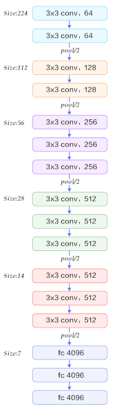

# Introduction to Convolutions

*Recommended resources: [Understanding Convolutions](http://colah.github.io/posts/2014-07-Understanding-Convolutions)*

Fully connected networks don't scale well to higher resolution images and deeper networks. For example, if you take an image detection network (taken from [YOLO](https://arxiv.org/abs/1506.02640)):

```
layer     filters    size              input                output
    0 conv     32  3 x 3 / 1   416 x 416 x   3   ->   416 x 416 x  32
    1 max          2 x 2 / 2   416 x 416 x  32   ->   208 x 208 x  32
    .......
   29 conv    425  1 x 1 / 1    13 x  13 x1024   ->    13 x  13 x 425
   30 detection
```

It has 30 layers, some of them with a large number of feature maps (such as 1024). A fully connected network would have countless weights, have a long inference time, and take a very long time to train. We need an alternative, faster operation on images.

## Convolutions

When using a fully connected network, all pixels are connected to all nodes in the next layer, regardless of their localization. However, in images, the location is an important property: when analyzing a pixel, its neighboring pixels, shapes and curves are much more relevant than pixels far away.

A convolution is a mathematical operation. Given two functions, it outputs a new function. The convolution is the integral of the product of the two functions as a function of the amount that one of the original functions is translated:


*Source: Wikipedia*

In a more intuitive explanation, the functions are translated to slide against the other. Then, the product of the functions is taken, and the area under the curve calculated.

Convolutional layers apply a localized operation using a sliding window. Each node in the next layer applies a function to a small window from the previous layer, being much cheaper than a fully connected network.

In the context of image processing, we don't have a continuous function, but a discrete set of pixels in two dimensions (a matrix). The convolution will also use weights organized as a matrix. These matrices will be multiplied elementwise and then summed.

The convolution matrix is called a **kernel**. A convolution of an image and a kernel will go through every pixel of the image. For each of them, it multiplies the value of the pixel and values of the surrounding pixels by the kernel corresponding value. Then it adds the results, and the initial pixel is set to this final result value.

Let's see some examples of convolutions (images taken from the [GIMP documentation](https://docs.gimp.org/en/plug-in-convmatrix.html)):

* First, a very simple example on how the sliding window mechanism is applied. If the kernel is a 3x3 matrix:

  ```
  0 1 0
  0 0 0
  0 0 0
  ```
  Applied on the following input (a 5x5 image):

  ```
  35 40 41 45 50
  40 40 42 46 52
  42 46 50 55 55
  48 52 56 58 60
  56 60 65 70 75
  ```

  All the pixels will be set to the value of the pixel above it. For example, in the centered pixel, multiplying the surrounding area by the kernel results in 42:


* Another example, using this kernel:

  ```
  1 0 1
  0 1 0
  1 0 1
  ```

  

  *Source: [Deep Learning in a Nutshell: Core Concepts](https://devblogs.nvidia.com/deep-learning-nutshell-core-concepts/)*

The kernel works like a function being reused throughout the entire image. Instead of having fully connected layers with a weight for each input and output pair, the kernel learns to detect a specific feature and is reused by sliding on the whole input.

* Simple 3x3 matrices can be used to apply effects and detect features, for example:

  * Sharpen by enhancing the difference with neighboring pixels:

    

    

  * Blur by averaging with neighboring pixels:

    

    

  * Edge detection by enhancing the pixels that are different from their neighbors:

    

    

If a convolutional layer has 16 output channels and 3x3 kernels, it means it has 16 different 3x3 matrices being convoluted with the input channels. Each of these can learn to detect some feature (such as borders, vertical lines, curves...). As the network gets deeper, higher level features and patterns can be detected by combining the previous layers.

## Pooling/Subsampling

When using convolutions, the layers will get wider (more channels) as we convolute: starting from raw pixels (usually 3 channel images), we'd like to extract many features (different types of borders, lightness, different color information), and each layer will get progressively wider. The resolution of the channels becomes less important as higher level features are discovered.

Reducing the resolution of channels reduces the amount of parameters and computation in the network and also controls overfitting. Pooling layers can be used to reduce the resolution.

Pooling layers operate independently on every channel and resize it spatially. The most common pooling operation is max pooling (operate on a set of pixels and take the maximum value).


*Source: Stanford's CS231n GitHub*

Some traditional architectures are built using only convolutions and max pooling, concatenated with fully connected layers. VGG is a classical example; although it's slower than newer alternatives, it's simple to understand and uses only the basic concepts of convolutional networks:



It uses 3x3 convolution kernels. We can see the number of feature channels increasing at each block: the 3 channel image is used to generate 64 channels, then 128, up to 512. The spatial resolution decreases at each pooling layer.

A more compact and visual representation of VGG is:


## Visualizations

These visualizations have been build with Keras to help understand the filters learned by the network. The network in use is VGG. [The source code and more visualizations can be found here](https://github.com/tiagoshibata/neural-network-visualizations).

Taking a look at the kernels, it's hard to see the operation being applied. For example, in layer `block1_conv1`, some of the kernels are:


In the image, the first three matrices in the first row are the weights relative to the three input channels, used to generate the first output channel. The next three are the weights relative to the three input channels to generate the second output channel, and so on.

A more interesting visualization is finding out which patterns are being captured by these filters. To do so, we can start with random noise and do gradient ascend, trying to find the input image that activates each specific filter the most.

Running it on the first convolution generates plain colors and simple patterns, such as colors, lines and waves:


Each of the next layers get activated by higher level, more complex features. The kernels in the next layer, for example:


The last convolution in block 3:


In the second convolution of block 4, some of the patterns resemble eyes or feathers:


Running the network on this car image, taken from ImageNet:


Generates the following outputs after the first convolution:


We can see, for example, that some of the layers output specific colors, while others output borders.

The next layers are able to detect higher level features. In the last convolution of block 2, some channels cover almost only the shadow of the car, others the wheels or lamps:


And the last convolution of block 3:


## Convolution parameters

*[An Introduction to different Types of Convolutions in Deep Learning](https://towardsdatascience.com/types-of-convolutions-in-deep-learning-717013397f4d) and [Convolution Arithmetic](https://github.com/vdumoulin/conv_arithmetic): these articles include good visualizations of convolutional operations and their parameters. The animated GIFs used here were taken from these sources.*

Many details of convolutions have been left out this far. For example, how to handle pixels in the edge of the image?

Convolutions have some parameters that change their behavior. Some commonly used parameters are:

* Padding: can be **valid** padding (don't pad, meaning the output channels have resolution slightly smaller than the input channels) or **same** padding (pad, so output channels have the same resolution of the input channels)
* Stride: How many pixels to skip when sliding the convolution window. Using a stride greater than 1 does subsampling of the input image (the output will have reduced resolution)

| Padding                                                      | Padding with strides                                         |
| ------------------------------------------------------------ | ------------------------------------------------------------ |
|  |  |

## Conclusions

* Convolutional layers can more easily extract localized image features at a much lower cost
* The lower parameter count is less prone to overfitting
* Memory usage is much lower
