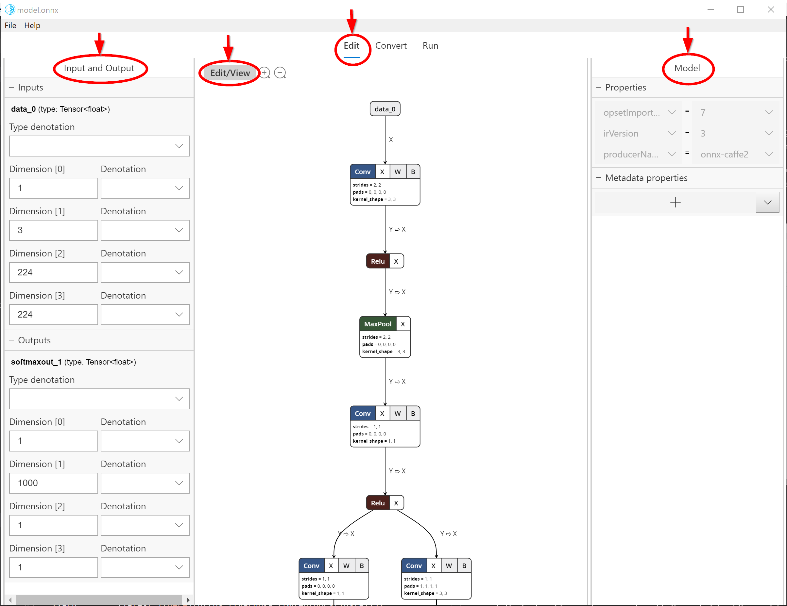
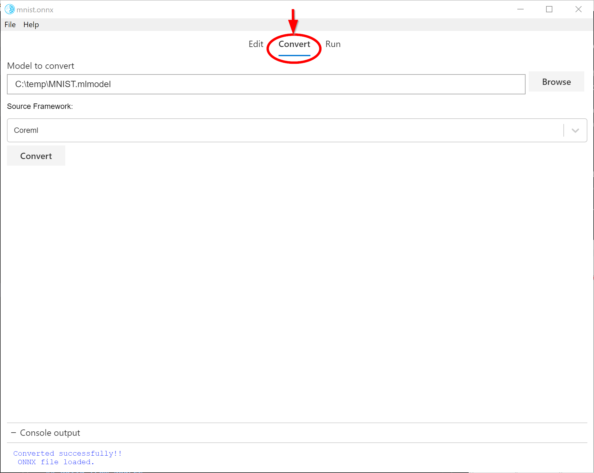
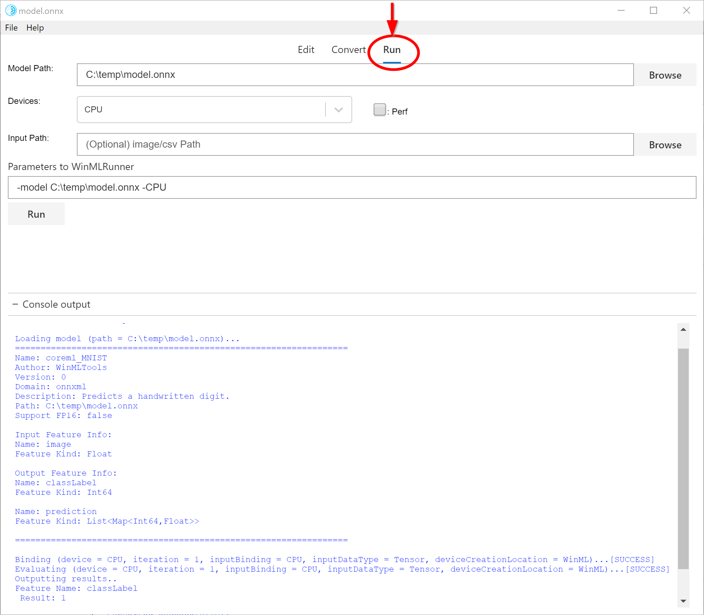

# WinML Dashboard (preview)

WinML Dashboard is a tool for **viewing**, **editing**, **converting**, and **validating** machine learning models for [Windows ML](https://docs.microsoft.com/en-us/windows/ai/) inference engine. The engine is built into Windows 10 and evaluates trained models locally on Windows devices using hardware optimizations for CPU and GPU to enable high performance inferences.   

Today there are several different frameworks available for training and evaluating machine learning models, which makes it difficult for app developers to integate models into their product. Windows ML uses [ONNX](http://onnx.ai/) machine learning model format that allows conversion from one framework format to another, and this Dashboard makes it easy to convert models from different frameworks to ONNX. 
 
 This tool supports converting to ONNX from the following source frameworks:
 - Apple Core ML
 - TensorFlow (subset of models convertible to ONNX)
 - Keras
 - Scikit-learn (subset of models convertible to ONNX)
 - Xgboost
 - LibSVM
 
The tool also allows validation of the converted model by evaluating the model with built-in Windows ML inference engine using synthetic data (default) or real input data on CPU or GPU.

## Viewing and Editing Models

The Dashboard uses [Netron](https://github.com/lutzroeder/netron) for viewing machine learning models. Although WinML uses ONNX format, the Netron viewer supports viewing several different framework formats. 

Many times a developer may need to update certain model metadata or modify model input and output nodes. This tool supports modifying model properties, metadata and input/output nodes of an ONNX model. 

Selecting **Edit** tab (center top as shown in the snip below) takes you to viewing and editing panel. The left pane in the panel allows editing model input and output nodes, and the right pane allows editing Model properties. The center portion shows the graph. At this time, editing support to limited to model input/output node (and not inner nodes), model properties and model metadata.

The **Edit/View** button switches from Edit mode to View-only mode and vice versa. View-only mode doesn't allow editing and enables Netron viewer's native features such as the ability to see detailed information for each node. 

## Converting Models

The **Convert** tab (see snip below) helps convert models from several different frameworks (as listed above) to ONNX format by [WinMLTools](https://pypi.org/project/winmltools/). Also you can select the ONNX version to convert to and apply Quantization. 

In order to do the conversion, the tool installs a separate Python environment and a set of converter tools. This helps alleviate one of the big pain points of a typical developer - installing the right Python environment and tool chain for conversion and validating the model. 

WinMLTools provides [quantization](https://docs.microsoft.com/en-us/windows/ai/convert-model-winmltools#quantize-onnx-model) feature to reduce the memory footprint of the model.

For **quantization:**

|Type        |Usage  |
|------------|-------|
|**Type1**   |Do not use dequantize_linear option, the converted model can only be run in Win10 released before [Version 1809 (OS build 17763)](https://support.microsoft.com/en-us/help/4464619/windows-10-update-history)   |
|**Type2**   |Use dequantize_linear option, the converted model can also be run in Win10 release after Version 1809 (OS build 17763) |

For **ONNX Version:**

|Version     |For Windows 10 Build|
|------------|--------------------|
|1.2         |[1809 (OS build 17763)](https://support.microsoft.com/en-us/help/4464619/windows-10-update-history)|
|1.3         |after 1809 (OS build 17763)|

## Validating Models

Once you have an ONNX model, you can validate whether the conversion has happened successfully and that the model can be evaluated in Windows ML inference engine. This is done using the **Run** tab (see snip below).

You can choose various options such as CPU (default) vs GPU, real input vs synthetic input (default) etc. The result of model evaluation appears in the console window at the bottom.

Note that model validation feature is only available on [Windows 10 October 2018 Update](https://www.microsoft.com/en-us/software-download/windows10) or newer version of Windows 10 as the tool relies on built-in Windows ML inference engine. 

## Install

You can install an early preview version of WinML Dashboard from here.

[Download Preview Version](https://github.com/Microsoft/Windows-Machine-Learning/releases)

Note that the prerelease version is not currently signed so you may see a warning about the binary being untrusted when you try to download and run the installer. 

Alternatively, you can build the app from source following the instructions below. 

## Build from source

#### Prerequisites

|Requirements|Version|Download|Command to check|
|------------|-------|--------|----------------|
|Python3     |3.4+   |[here](https://www.python.org/)|`python --version`|
|Yarn        |latest |[here](https://yarnpkg.com/en/docs/install)|`yarn --version`|
|Node.js     |latest |[here](https://nodejs.org/en/)|`node --version`|
|Git         |latest |[here](https://git-scm.com/download/win)|`git --version`|

> All four prerequisites should be **added to Enviroment Path**.

#### Steps to build and run

1. `git clone https://github.com/Microsoft/Windows-Machine-Learning`

2. `cd Tools/WinMLDashboard`
3. Run `Git submodule update --init --recursive` to update Netron.
4. Run `yarn` to download dependencies. 
5. Then, run `yarn electron-prod` to build and start the desktop application, which will launch the Dashboard.

> All available commands can be seen at [package.json](package.json).

### Debugging

To open the **debug view** in the Electron app

* Run it with flag `--dev-tools`
* Or select `View -> Toggle Dev Tools` in the application menu
* Or press `Ctrl + Shift + I`.

### Getting Models

- [ONNX Model Zoo](https://github.com/onnx/models)

## Feedback
- For issues, file a bug on [GitHub Issues](https://github.com/Microsoft/Windows-Machine-Learning/issues).
- For feature requests, file an issue on [GitHub Issues](https://github.com/Microsoft/Windows-Machine-Learning/issues/new)
- Ask questions on [Stack Overflow](https://stackoverflow.com/questions/tagged/windows-machine-learning).

### License

This tool is under the MIT license. 
