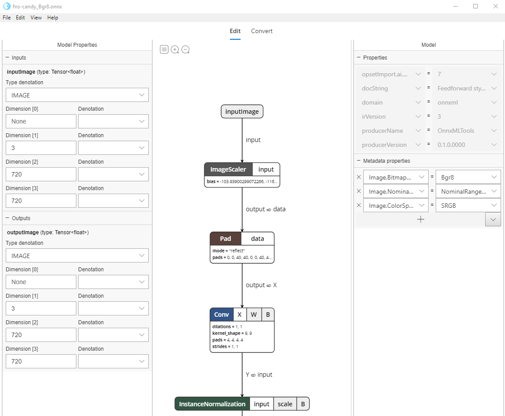
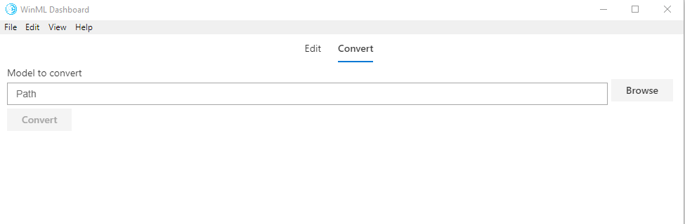

# Windows ML Dashboard

Developer dashboard for Windows ML and ONNX.

## What you can with this tool
1. The tool enables you to view and modify the metadata of the model and the metadata of input and output nodes.



2. The tool enables you to convert models to ONNX.

## Build from source

#### Prerequisites

|Requirements|Version|Download|Command to check|
|------------|-------|--------|----------------|
|Python3     |3.4+   |[here](https://www.python.org/)|`python --version`|
|Yarn        |latest |[here](https://yarnpkg.com/en/docs/install)|`yarn --version`|
|Node.js     |latest |[here](https://nodejs.org/en/)|`node --version`|
|Git         |latest |[here](https://git-scm.com/download/win)|`git --version`|

> All four prerequisites should be **added to Enviroment Path**.

#### Steps to build

1. `git clone https://github.com/Microsoft/Windows-Machine-Learning`

2. `cd Tools/WinMLDashboard`
3. Run `Git submodule update --init --recursive` to update Netron.
4. Run `yarn` to download dependencies. 
5. Then, run `yarn electron-prod` to build and start the desktop application, which will launch the Dashboard.

> All available commands can be seen at [package.json](package.json).

### How to use the tool

1. Convert To Onnx File
   * Click the `Convert` Tab
   * Select the **sencond option (recommand)** to install python enviroment(take minutes). It would be save to select the first option if you are sure you have intalled all required python packages in `./public/requirement.txt`
   * Click `browse` to locate your file to convert
   * Click `convert` button to save the output file first and start conversion.
2. Edit Onnx File
   * Press `Cltr + O` to open a new Onnx file, and the default file is what you just converted from other platforms.
   * The right panel is visible by default, which is designed to be used to change the metadata of the model.
   * For left panel, click any node of the graph, or click the left button among the three left-top buttons. The left panel is designed to show and change the metadata of the Graph. **Only input node and output node are changeable, internal nodes are not**.
   * Press `Ctrl + S` to **save the changes to the same file**.

### Debugging

To open the **debug view** in the Electron app

* Run it with flag `--dev-tools`
* Or select `View -> Toggle Dev Tools` in the application menu
* Or press `Ctrl + Shift + I`.

### Distribution

To distribute the application, you can copy the whole `build` folder and the files `src/electronMain.js` and `package.json` to `node_modules/electron/dist/resources/app`, and distribute the folder `node_modules/electron/dist`. The final directory structure in `node_modules/electron/dist/resources` should be:

```
app/
├───build/
├───────...
├───src/
│   └───electronMain.js
└───package.json
```

[Electron builder](https://github.com/electron-userland/electron-builder) can be used to generate installers. [See the documentation here](https://www.electron.build/).

### Built with

* [Electron](https://electronjs.org/)
* [React](https://reactjs.org/)
* [Redux](https://redux.js.org/)

### License

This tool is under the MIT license. The license can be found at the root of this repository.